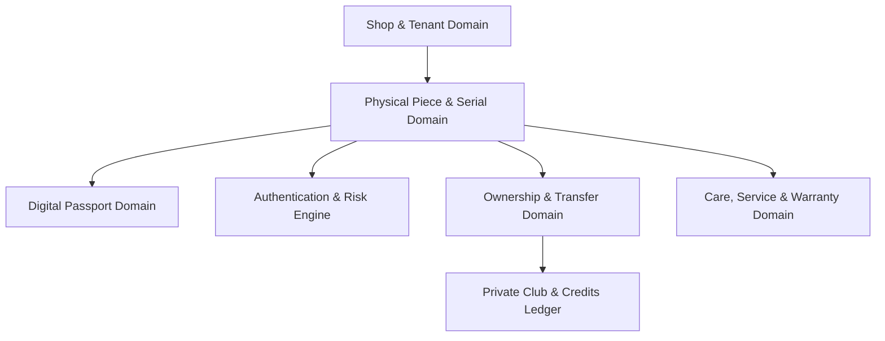

# System Architecture & Technical Specification

## Overview
This platform is a **Multi-Tenant SaaS Shopify Application** designed to provide **Digital Product Passports, Serialized Physical Identity, Layered Authentication, Ownership Registry & Secure Transfers, and Private Club Patron Relationships** for Shopify merchants.

---

## Core Architectural Pillars

### 1. Multi-Tenancy from Day One
- Every merchant-owned database table includes `shop_id`.
- Tenant context is resolved from authenticated Shopify sessions and server-side authorization middleware.
- Cross-tenant data leakage is strictly prohibited by both database constraints and tenant-scoped repository queries.

### 2. Shopify Remains the Source of Truth for Commerce
- Products, product variants, inventory, orders, checkout, payments, and storefronts remain inside Shopify.
- Our application database owns domain-specific entities:
  - Physical pieces & serial numbers
  - Digital passports & craftsmanship stories
  - Ownership records & transfer state machines
  - Layered authentication telemetry & risk anomalies
  - Private Club membership tiers & immutable credit ledgers
  - Atelier care schedules & service cases

### 3. Theme-Agnostic Storefront Extension
- The `digital-product-identity` Theme App Extension runs on pure Liquid and vanilla CSS with zero heavy JavaScript frameworks.
- It dynamically adapts to any Shopify Online Store theme (Dawn, Prestige, Horizon, custom) using Theme Editor schema settings.

### 4. Low-Cost Modular Monolith
- Built as a clean, single-deployable application without premature microservices, Kafka, or Kubernetes overhead.
- Scales gracefully from $0-$10/mo early stage to thousands of merchants on shared infrastructure.

---

## Domain Architecture Map

